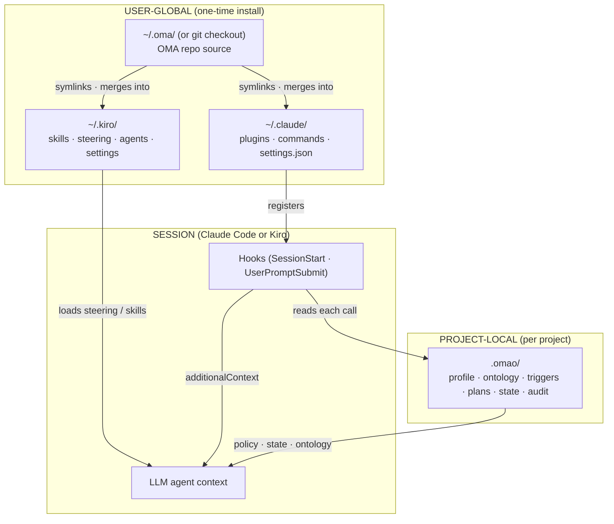
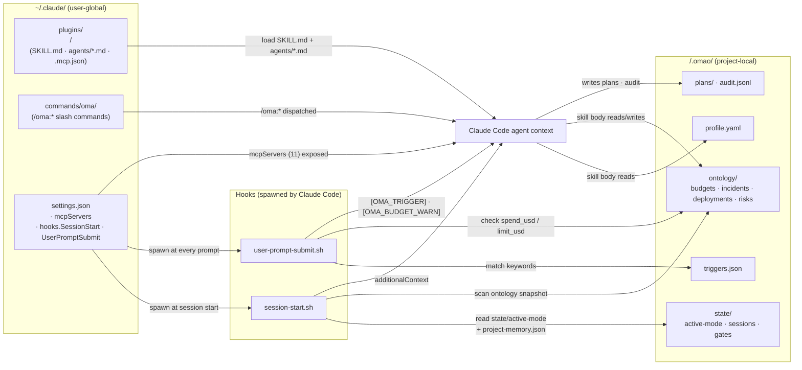
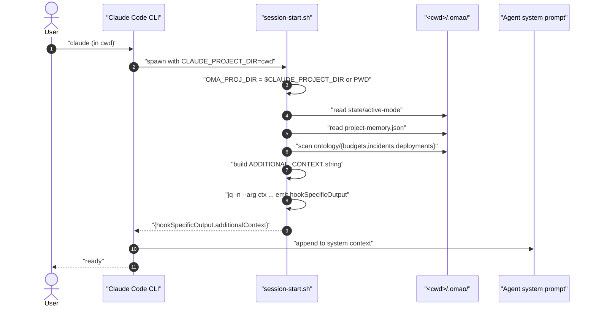
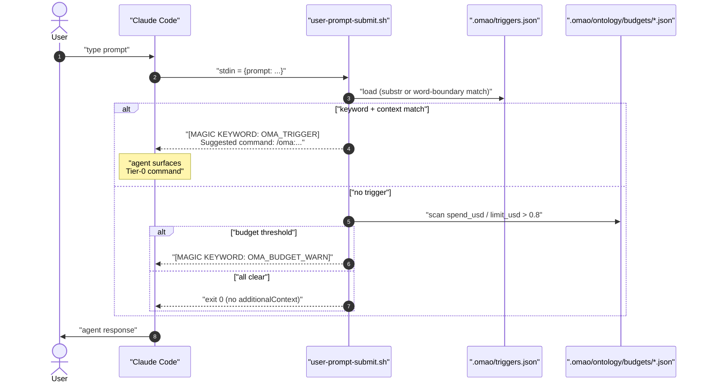
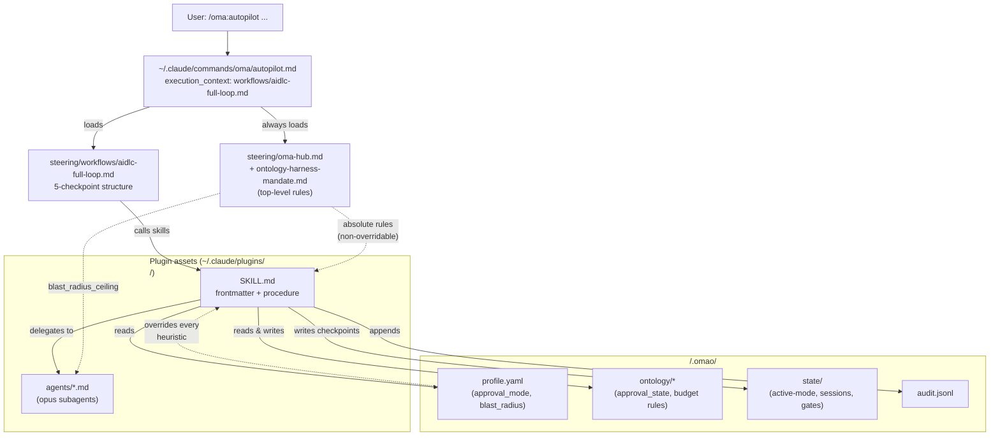
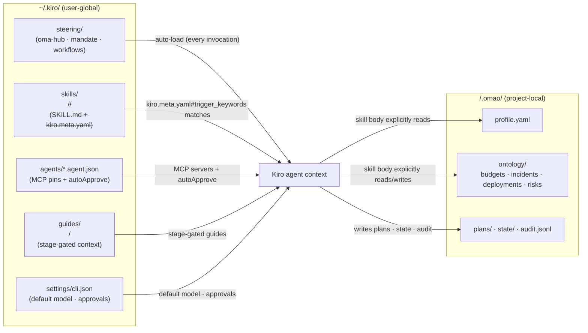

# Architecture — OMA's Two-Layer Model

This page consolidates **how `oh-my-aidlcops` lays itself out on the user's machine** and **what happens when a Claude Code or Kiro session starts**. The goal is that an engineer can answer "which file do I edit to change behavior X" in one read.

Diagram labels are English, body prose is English, and every mermaid node and edge label is double-quoted.

## Core model — three facts

OMA's architecture compresses into three statements. §1, §2, and §3 of this page each correspond to one statement.

1. **Assets are split into two layers.** Assets in the OMA repo (`~/.oma/` or a git checkout) are symlinked or merged once into a user-global directory (`~/.claude/` or `~/.kiro/`) at install time. Each project the user works in gets its own `<project>/.omao/` containing *only that project's policy and state*. In short, **capability is user-global; policy is project-local**.

2. **The two harnesses pull policy in different ways.**
   - **Claude Code** is *active*. Hooks registered in `~/.claude/settings.json` run on every session start and every user prompt; they read the cwd's `.omao/` and inject the result into the system context as `additionalContext` JSON.
   - **Kiro** is *declarative*. There are no hooks. Instead the Kiro engine reloads `~/.kiro/steering/`, `kiro.meta.yaml`, and `agents/*.json` on every invocation, and SKILL bodies explicitly Read `.omao/` when they need policy values.

3. **`.omao/` is the shared surface across both harnesses.** You can switch between Claude Code and Kiro on the same project without losing work — both read and write the same `profile.yaml`, `ontology/`, `plans/`, `state/`, and `audit.jsonl` under the same conventions. One asymmetry, caused by the absence of Kiro hooks, is documented in §2.6.

The safety property that holds across both harnesses is that *the session is never mutated — only context is appended*. In a project without `.omao/`, Claude Code hooks all no-op out, and Kiro simply runs without policy values, falling back to its static assets.

## What this document covers — overview diagram



This diagram is the spine of the document. Each arrow is detailed in the per-harness sections — §1 (Claude Code) and §2 (Kiro) — and the shared piece is summarized in §3.

| Layer | Role | Change frequency | Created by |
| --- | --- | --- | --- |
| **`~/.oma/` or `~/Dev/sample-oh-my-aidlcops/`** | OMA source tree (plugins, skills, hook scripts, compiler) | At each OMA release | `install.sh` or `git clone` |
| **`~/.claude/`** | User-global config consumed by Claude Code | Once per OMA install | [`scripts/install/claude.sh`](https://github.com/aws-samples/sample-oh-my-aidlcops/blob/main/scripts/install/claude.sh) or `/plugin marketplace add` |
| **`~/.kiro/`** | User-global assets consumed by Kiro | Once per OMA install | [`scripts/install/kiro.sh`](https://github.com/aws-samples/sample-oh-my-aidlcops/blob/main/scripts/install/kiro.sh) |
| **`<project>/.omao/`** | That project's policy and state | Continuously, per task | [`oma setup`](https://github.com/aws-samples/sample-oh-my-aidlcops/blob/main/scripts/oma/setup.sh), [`oma init`](https://github.com/aws-samples/sample-oh-my-aidlcops/blob/main/scripts/oma/init.sh), and individual skills |

Document flow:

1. **§1 Claude Code harness** — how hooks pinned in `settings.json` turn `.omao/` into context on every call.
2. **§2 Kiro harness** — how steering, sidecars, and agent profiles re-pull policy *rules* every invocation without hooks.
3. **§3 Shared — `<project>/.omao/`** — the policy surface both harnesses share. Producer/consumer mapping and edit points.

---

## 1. Claude Code harness

The Claude Code harness centers on an **active model**: hook scripts emit `additionalContext` JSON on stdout, and Claude Code appends it to the system prompt. Static assets (plugins, commands, MCP) are exposed via `~/.claude/settings.json`. Dynamic policy (`.omao/`) is read by the hooks on every session and every prompt.

### 1.1 What each asset references



§1.2 through §1.6 detail what every arrow above corresponds to in code.

### 1.2 Install — how `~/.claude/` gets populated

[`scripts/install/claude.sh`](https://github.com/aws-samples/sample-oh-my-aidlcops/blob/main/scripts/install/claude.sh) seats the user-global assets in four steps. The native marketplace path (`/plugin marketplace add ...`) yields the same result — it just additionally caches a copy under `~/.claude/plugins/cache/` and records it in `~/.claude/installed_plugins.json`.

| Step | Function | Result | Diagram node |
| --- | --- | --- | --- |
| 1 | `install_plugins` ([claude.sh:108](https://github.com/aws-samples/sample-oh-my-aidlcops/blob/main/scripts/install/claude.sh#L108)) | 4 symlinks under `~/.claude/plugins/<name>/` → SOURCE `plugins/<name>/` | `PLUG` |
| 2 | `install_commands` ([claude.sh:130](https://github.com/aws-samples/sample-oh-my-aidlcops/blob/main/scripts/install/claude.sh#L130)) | `~/.claude/commands/oma/` symlink → SOURCE `steering/commands/oma/` | `CMD` |
| 3 | `install_mcp_servers` ([claude.sh:143](https://github.com/aws-samples/sample-oh-my-aidlcops/blob/main/scripts/install/claude.sh#L143)) | jq-merge each plugin's `.mcp.json` `mcpServers` into `~/.claude/settings.json` (existing keys preserved) | `SET#mcpServers` |
| 4 | `install_hooks` ([claude.sh:169](https://github.com/aws-samples/sample-oh-my-aidlcops/blob/main/scripts/install/claude.sh#L169)) | Register hook script paths under `~/.claude/settings.json#hooks.SessionStart` and `hooks.UserPromptSubmit` | `SET#hooks` |

Resulting layout:

```text
~/.claude/
  plugins/<plugin>/         → SOURCE/plugins/<plugin>            # PLUG (symlink)
  commands/oma/             → SOURCE/steering/commands/oma       # CMD  (symlink)
  settings.json
    "mcpServers": { aws-documentation, aws-iac, aws-pricing, ... } # 11 entries (SET#mcp)
    "hooks": {
      "SessionStart":      [{ "hooks": [{"command": "SOURCE/hooks/session-start.sh"}]}],
      "UserPromptSubmit":  [{ "hooks": [{"command": "SOURCE/hooks/user-prompt-submit.sh"}]}]
    }
```

### 1.3 SessionStart hook — context injection at session start

Detail of the `SET → SS → ST · ONT → AGENT` arrows.



Context blocks emitted at every session start:

| Block | Source | Code location |
| --- | --- | --- |
| `[OMA Session Context] Active Tier-0 Mode: ...` | `cwd/.omao/state/active-mode` | [session-start.sh:25](https://github.com/aws-samples/sample-oh-my-aidlcops/blob/main/hooks/session-start.sh#L25) |
| `Project Memory: { ... }` | `cwd/.omao/project-memory.json` | [session-start.sh:39](https://github.com/aws-samples/sample-oh-my-aidlcops/blob/main/hooks/session-start.sh#L39) |
| `[OMA Ontology]` (one line per Budget · Incident · Deployment) | `cwd/.omao/ontology/<type>/*.json` | [session-start.sh:53-87](https://github.com/aws-samples/sample-oh-my-aidlcops/blob/main/hooks/session-start.sh#L53-L87) |
| `Available OMA Tier-0 Commands: ...` (static catalog) | hardcoded | [session-start.sh:92](https://github.com/aws-samples/sample-oh-my-aidlcops/blob/main/hooks/session-start.sh#L92) |

Safety guarantees:
- **Honors `CLAUDE_PROJECT_DIR` over cwd** — the hook reads the right `.omao/` even when Claude Code spawns it from a different working directory ([session-start.sh:20](https://github.com/aws-samples/sample-oh-my-aidlcops/blob/main/hooks/session-start.sh#L20)).
- **JSON is emitted via `jq`, `python3`, or `python` (in that order)** — if none are present the hook exits 1. The hook never builds JSON via shell interpolation, so ontology files containing quotes, backslashes, or newlines remain safe ([session-start.sh:118-150](https://github.com/aws-samples/sample-oh-my-aidlcops/blob/main/hooks/session-start.sh#L118-L150)).
- **Kill switches** — `OMA_DISABLE_TRIGGERS=1` or `OMA_DISABLE_ONTOLOGY=1` env vars ([session-start.sh:12,53](https://github.com/aws-samples/sample-oh-my-aidlcops/blob/main/hooks/session-start.sh#L12)).

#### 1.3.1 Two SessionStart hooks — CLI/dev vs marketplace (#60)

There are **two** SessionStart hooks, delivered by two different install paths.
Knowing which one runs matters because only one of them ships through
`/plugin install`.

| Hook | Delivered by | Injects | Repo-root deps |
|---|---|---|---|
| `hooks/session-start.sh` (repo-root) | `scripts/install/claude.sh` → `~/.claude/settings.json#hooks.SessionStart` — i.e. `oma setup` / dev install | Tier-0 mode · project-memory · **ontology snapshot** · permissions-drift · command catalog | Yes (`scripts/lib/permissions.sh`) |
| `plugins/{ai-infra,aidlc}/hooks/session-start-ontology.sh` | **`/plugin install`** (bundled in the plugin root) | **ontology snapshot only** | None — self-contained |

The plugin-bundled hook exists because, per the Claude Code plugin spec,
`/plugin install` ships only files inside the plugin root — the repo-root
`hooks/session-start.sh` is **not** delivered by the marketplace path. Before
this, a marketplace-only user got no ontology-state injection at all (#60). The
bundled hook is emitted into each plugin's `hooks/hooks.json` `SessionStart`
entry by `oma-compile` from the DSL `hooks.session-start.runs` declaration, and
reads **only** `.omao/ontology/` so it works verbatim from an installed copy.
Its `${CLAUDE_PLUGIN_ROOT}`-anchored command is validated at compile time to
stay inside the plugin — a `../`-escaping path is a `CompileError`.

The two hooks are complementary, not redundant: a full `oma setup` install runs
the richer repo-root hook (which supersedes the ontology-only block); a
marketplace-only install runs the bundled one. The `oma`-CLI conveniences the
marketplace path still does **not** deliver — the ontology **schemas**
(`schemas/ontology/`, used by `oma validate`) and the **seed templates**
(`templates/ontology/`, rendered by `oma setup`) — remain CLI-only by design:
they are consumed by the CLI, not read by an installed skill, and (post the
`$ref` enum refactor) cannot be copied into a plugin without breaking their
cross-file `$ref`s. Use `oma setup` / `git clone` when you need them.

### 1.4 UserPromptSubmit hook — keyword and budget checks per prompt

Detail of the `SET → UPS → TRIG · ONT → AGENT` arrows.



| Output | Trigger condition | Code location |
| --- | --- | --- |
| `[MAGIC KEYWORD: OMA_TRIGGER]` | A `.omao/triggers.json` keyword matches the prompt and (if present) every `context_required` token is also present | [user-prompt-submit.sh:55-124](https://github.com/aws-samples/sample-oh-my-aidlcops/blob/main/hooks/user-prompt-submit.sh#L55-L124) |
| `[MAGIC KEYWORD: OMA_BUDGET_WARN]` | Any budget's `spend_usd / limit_usd > 0.8` | [user-prompt-submit.sh:130-155](https://github.com/aws-samples/sample-oh-my-aidlcops/blob/main/hooks/user-prompt-submit.sh#L130-L155) |
| (none) | Nothing matches — prompt passes through normally | `exit 0` |

Match rules:
- Slash commands (`/oma:agenticops`) and multi-word phrases use substring matching.
- Single tokens use `grep -qw` word-boundary matching (e.g., `auto` does not match inside `automobile`).
- Explicit slash commands bypass `context_required`.

### 1.5 Tier-0 dispatch — where static assets meet dynamic policy

Once the session is up, the user invokes a slash command such as `/oma:autopilot`. From that point on, static assets (`PLUG`, `CMD`) and dynamic policy (`PROF`, `ONT`, `ST`) coexist in the same context.



The top-of-stack hierarchy is enforced by [`steering/oma-hub.md:9-30`](https://github.com/aws-samples/sample-oh-my-aidlcops/blob/main/steering/oma-hub.md#L9-L30) and [`steering/workflows/ontology-harness-mandate.md:11-49`](https://github.com/aws-samples/sample-oh-my-aidlcops/blob/main/steering/workflows/ontology-harness-mandate.md#L11-L49) — the seven absolute rules there **override** every SKILL.md body.

### 1.6 Where to edit (Claude Code side)

| Behavior to change | Single edit point | Follow-up command |
| --- | --- | --- |
| Add or version-bump an MCP server | `mcp:` block in `plugins/<plugin>/<plugin>.oma.yaml` | `python3 -m tools.oma_compile <file>` then re-merge with `bash scripts/install/claude.sh` |
| New keyword trigger | `triggers:` block in `<plugin>.oma.yaml` | `oma compile`, then copy `.omao/triggers.json` into the user's project |
| New Tier-0 slash command | Add `steering/commands/oma/<name>.md` and update `<plugin>.oma.yaml#triggers` | The symlink already points at `~/.claude/commands/oma/`, so a CLI restart is enough |
| New SKILL | Add `plugins/<plugin>/skills/<skill>/SKILL.md` | Claude Code picks it up immediately (symlink) |
| New session-start context block | Update the ADDITIONAL_CONTEXT accumulator in `hooks/session-start.sh` | Verify with `bash hooks/session-start.sh` |
| Change prompt match rules | `hooks/user-prompt-submit.sh` (e.g., word boundaries) | `echo '{"prompt":"..."}' \| bash hooks/user-prompt-submit.sh` |

---

## 2. Kiro harness

Kiro **has no hooks**. Where Claude Code actively emits context via hook scripts, Kiro is declarative — its engine re-reads `~/.kiro/steering/`, `kiro.meta.yaml`, and `agents/*.json` on every invocation, and SKILL bodies explicitly Read `.omao/` when needed.

### 2.1 What each asset references



§2.2 through §2.5 detail every arrow above with code locations.

### 2.2 Install — how `~/.kiro/` gets populated

[`scripts/install/kiro.sh`](https://github.com/aws-samples/sample-oh-my-aidlcops/blob/main/scripts/install/kiro.sh) runs five steps. **There is no hook-registration step** — that is the decisive difference from Claude Code.

| Step | Function | Result | Diagram node |
| --- | --- | --- | --- |
| 1 | `install_skills` ([kiro.sh:91](https://github.com/aws-samples/sample-oh-my-aidlcops/blob/main/scripts/install/kiro.sh#L91)) | Flattened symlinks under `~/.kiro/skills/<p>/<s>/`. Two-level groups like `aidlc/skills/inception/<s>` get one extra descent | `SK` |
| 2 | `install_steering` ([kiro.sh:145](https://github.com/aws-samples/sample-oh-my-aidlcops/blob/main/scripts/install/kiro.sh#L145)) | `~/.kiro/steering` → SOURCE `steering/` (manifest, workflows, oma-hub.md) | `ST` |
| 3 | `install_guides` ([kiro.sh:157](https://github.com/aws-samples/sample-oh-my-aidlcops/blob/main/scripts/install/kiro.sh#L157)) | Per-plugin stage-gated guide directories | `GD` |
| 4 | `install_agents` ([kiro.sh:176](https://github.com/aws-samples/sample-oh-my-aidlcops/blob/main/scripts/install/kiro.sh#L176)) | Kiro `.agent.json` profiles (MCP pins + `autoApprove`) | `AG` |
| 5 | `install_settings` ([kiro.sh:199](https://github.com/aws-samples/sample-oh-my-aidlcops/blob/main/scripts/install/kiro.sh#L199)) | Copy template into `~/.kiro/settings/cli.json` (preserved if already present) | `CFG` |

Resulting layout:

```text
~/.kiro/
  skills/<plugin>/<skill>/  → SOURCE/plugins/<plugin>/skills/<skill>     # SK  (symlink)
  steering/                 → SOURCE/steering                            # ST  (symlink)
  guides/<plugin>/          → SOURCE/plugins/<plugin>/guides             # GD  (symlink)
  agents/*.agent.json       → SOURCE/plugins/<plugin>/kiro-agents/*.json # AG  (symlink)
  settings/cli.json         (file copy from scripts/kiro-cli.template.json) # CFG
```

### 2.3 Steering auto-load — absolute rule injection

The `ST → AGENT` arrow.

The Kiro engine auto-loads everything under `~/.kiro/steering/` on every invocation. Consequently the following content is always present in every Kiro session:

- [`oma-hub.md`](https://github.com/aws-samples/sample-oh-my-aidlcops/blob/main/steering/oma-hub.md) — routing hub plus the seven ABSOLUTE RULES
- [`workflows/ontology-harness-mandate.md`](https://github.com/aws-samples/sample-oh-my-aidlcops/blob/main/steering/workflows/ontology-harness-mandate.md) — non-overridable absolute-rules text
- [`workflows/diagram-authoring-standard.md`](https://github.com/aws-samples/sample-oh-my-aidlcops/blob/main/steering/workflows/diagram-authoring-standard.md) — diagram-tool mandate
- `workflows/aidlc-full-loop.md`, `workflows/platform-bootstrap.md`, ... — 5-checkpoint workflow definitions
- `commands/oma/*.md` — Kiro does not dispatch slash commands but uses these files as skill-orchestration reference material

This is equivalent to the *rules side* of Claude Code's SessionStart hook — the differences are summarized in §2.6.

### 2.4 SKILL matching — sidecar `trigger_keywords`

The `SK → AGENT` arrow.

A `kiro.meta.yaml` sidecar can sit next to each SKILL (see [kiro-setup.md:98-134](https://github.com/aws-samples/sample-oh-my-aidlcops/blob/main/docs/docs/kiro-setup.md#L98-L134)). The Kiro engine reads it to auto-match natural-language inputs to a SKILL.

```yaml
# kiro.meta.yaml — example for vllm-serving-setup
kiro:
  trigger_keywords:
    - "vllm"
    - "model serving"
    - "PagedAttention"
  context_files:
    - SKILL.md
    - reference/vllm-config.yaml
  mcp_required:
    - eks-mcp-server
    - aws-pricing-mcp-server
  phase: operations
  approval_required: true
```

| Field | Effect |
| --- | --- |
| `trigger_keywords` | Boost SKILL matching priority on natural-language input |
| `context_files` | Additional files to load alongside the SKILL |
| `mcp_required` | Verify required MCP servers are connected before invocation |
| `phase` | Tag as Inception / Construction / Operations |
| `approval_required` | Whether checkpoint approval is required |

A SKILL without a sidecar still works fine — just on its `SKILL.md` frontmatter alone.

### 2.5 Agent profile — `agents/*.agent.json`

The `AG → AGENT` arrow.

Each Kiro agent profile is a compile output of [`tools/oma_compile`](https://github.com/aws-samples/sample-oh-my-aidlcops/blob/main/tools/oma_compile/compile.py) reading SOURCE `<plugin>.oma.yaml#agents`. **Where Claude Code consolidates 11 MCP servers in a single `settings.json`, Kiro pins MCPs per agent.**

```json
// ~/.kiro/agents/ai-infra.agent.json — symlink → SOURCE/plugins/ai-infra/kiro-agents/...
{
  "name": "ai-infra",
  "description": "AI runtime infrastructure architect ...",
  "tools": ["*"],
  "mcpServers": {
    "awslabs.eks-mcp-server":            { "command": "uvx", "args": ["awslabs.eks-mcp-server==0.1.28"], ... },
    "awslabs.aws-documentation-mcp-server": { ... },
    "awslabs.aws-pricing-mcp-server":    { ... },
    "awslabs.cloudwatch-mcp-server":     { ... }
  },
  "autoApprove": { "readOnly": true, "fileWrites": false, "bashCommands": false },
  "resources": ["file://.kiro/steering/oma-hub.md", "skill://.kiro/skills/ai-infra/**/*.md"]
}
```

At runtime the user activates a profile with `@ai-infra deploy vllm 70b` or similar.

### 2.6 Kiro asymmetry — the gap left by absent hooks

Some context that Claude Code's hooks actively push is **not** auto-pushed under Kiro. Operators must close the gap by Reading the relevant files explicitly inside SKILL procedures.

| Context | Claude Code | Kiro |
| --- | --- | --- |
| **Steering absolute rules** (`oma-hub.md`, `mandate.md`) | Auto-loaded by Claude Code without hooks | `~/.kiro/steering/` auto-load ✅ |
| **SKILL bodies** | `~/.claude/plugins/<p>/skills/<s>/SKILL.md` | `~/.kiro/skills/<p>/<s>/SKILL.md` ✅ |
| **MCP server catalog** | Global in `settings.json#mcpServers` | Per-agent in agent profile ✅ |
| **Ontology *current values* snapshot** (Budget remaining, open incidents, draft deployments) | Pushed by `session-start.sh` at every session start ✅ | ❌ No auto-push. SKILL body must Read explicitly |
| **active-mode / project-memory** | Pushed by `session-start.sh` ✅ | ❌ No auto-push |
| **Per-prompt budget threshold warning** (`[OMA_BUDGET_WARN]`) | Checked by `user-prompt-submit.sh` on every prompt ✅ | ❌ No per-prompt check |
| **Keyword triggers** (natural language → Tier-0 command) | `user-prompt-submit.sh` + global `.omao/triggers.json` catalog ✅ | △ `kiro.meta.yaml#trigger_keywords` handles only *SKILL matching* (no Tier-0 catalog) |

Implications:
- When a Kiro user runs `@ai-infra deploy ...`, the agent **starts unaware** of whether the budget is at 80%, whether a draft deployment exists, etc. The SKILL procedure must explicitly Read `.omao/ontology/budgets/*.json` and `.omao/ontology/deployments/*.json` to surface that.
- Absolute Rule #4 from [`steering/workflows/ontology-harness-mandate.md`](https://github.com/aws-samples/sample-oh-my-aidlcops/blob/main/steering/workflows/ontology-harness-mandate.md) — *"on receiving `[MAGIC KEYWORD: OMA_BUDGET_WARN]`, the agent must surface the warning in its first response"* — is Claude-Code-specific. Under Kiro the magic keyword is never emitted, so the rule lapses. Operationally, work around this by invoking the `cost-governance` skill explicitly or registering the budget file under `kiro.meta.yaml#context_files`.

### 2.7 Where to edit (Kiro side)

| Behavior to change | Single edit point | Follow-up command |
| --- | --- | --- |
| Kiro agent's MCP pins | `agents:` block in `<plugin>.oma.yaml` (runtime: kiro) | `python3 -m tools.oma_compile <file>` then re-run `bash scripts/install/kiro.sh` (refreshes symlinks) |
| Kiro agent's `autoApprove` defaults | The compiler hardcodes `{readOnly: true, fileWrites: false, bashCommands: false}` ([compile.py:213-217](https://github.com/aws-samples/sample-oh-my-aidlcops/blob/main/tools/oma_compile/compile.py#L213-L217)); change there or hand-edit the emitted `kiro-agents/<id>.agent.json` | Re-run install if you edited the compiler |
| New Kiro agent profile | Same place — agent id, description, tools, mcp, resources | Same — `kiro-agents/<id>.agent.json` is regenerated |
| SKILL `trigger_keywords` | The SKILL directory's `kiro.meta.yaml` (create one if absent) | Symlink already points; restart Kiro |
| Absolute rules / new workflow definition | `steering/oma-hub.md` or `steering/workflows/<name>.md` | Reflected in every Kiro session immediately (steering auto-load) |
| New SKILL | `plugins/<plugin>/skills/<skill>/` (SKILL.md plus optional `kiro.meta.yaml`) | Re-run `bash scripts/install/kiro.sh` to add the skill symlink |
| Kiro default model / autoApprove | `~/.kiro/settings/cli.json` (user-editable; one-time copy from template) | Restart Kiro |
| Stage-gated guide | `plugins/<plugin>/guides/stages/<stage>.md` | Symlink already points; effect is immediate |

---

## 3. Shared — `<project>/.omao/`

`.omao/` is the policy surface both harnesses share. The reason switching between Claude Code and Kiro on the same project does not lose work is that both read and write `.omao/` under identical conventions.

### 3.1 Disk layout

```text
<project>/.omao/
  profile.yaml                        # 7-Q wizard output (oma setup)
  ontology/{budgets,deployments,risks,incidents}/*.json
  triggers.json                       # copy of repo's compile output
  plans/                              # AIDLC artifacts (spec, design, ADR, stories)
  state/                              # active-mode, sessions, gates, audit/...
  audit.jsonl                         # schema-validated audit log
  notepad.md
  project-memory.json
```

A single `oma setup` ([scripts/oma/setup.sh](https://github.com/aws-samples/sample-oh-my-aidlcops/blob/main/scripts/oma/setup.sh)) configures both user-global (`~/.claude/` or `~/.kiro/`) and project-local (`.omao/`) at once. For subsequent projects, `oma init` alone creates a fresh `.omao/` without re-running the wizard.

### 3.2 Producer / consumer mapping

Each artifact has a clearly separated producer and consumer. To make a change, locate the producer in this table.

| `.omao/` path | Producer | Consumer | Schema |
| --- | --- | --- | --- |
| `profile.yaml` | `oma setup` ([setup.sh:152](https://github.com/aws-samples/sample-oh-my-aidlcops/blob/main/scripts/oma/setup.sh#L152)) | every SKILL · `oma doctor` · `enterprise-status` | [`schemas/profile/profile.schema.json`](https://github.com/aws-samples/sample-oh-my-aidlcops/blob/main/schemas/profile/profile.schema.json) |
| `ontology/budgets/*.json` | `oma setup` seed plus the FinOps team manually | `cost-governance` · Claude `user-prompt-submit.sh` · `session-start.sh` | [`budget.schema.json`](https://github.com/aws-samples/sample-oh-my-aidlcops/blob/main/schemas/ontology/budget.schema.json) |
| `ontology/deployments/*.json` | `aidlc.code-generation` · `autopilot-deploy` | `incident-response` · strict-enterprise gate | `deployment.schema.json` |
| `ontology/incidents/*.json` | `agenticops.incident-response` | Claude `session-start.sh` snapshot · human approver | `incident.schema.json` |
| `ontology/risks/*.json` | `aidlc.risk-discovery` · `modernization.risk-discovery` | `quality-gates` · strict-enterprise gate | `risk.schema.json` |
| `triggers.json` | `oma compile` ([compile.py:41](https://github.com/aws-samples/sample-oh-my-aidlcops/blob/main/tools/oma_compile/compile.py#L41)) | Claude `user-prompt-submit.sh` (Kiro uses sidecars instead) | `dsl.schema.json#triggers` |
| `plans/<slug>/*.md` | `aidlc.inception.*` · `aidlc.construction.*` | Human reviewers · downstream skills | (free-form) |
| `state/active-mode` | Set when entering a Tier-0; cleared by `/oma:cancel` | Claude `session-start.sh` · other Tier-0 commands (collision avoidance) | (single line) |
| `state/sessions/<id>/checkpoint.json` | `aidlc-full-loop` workflow | Human approver · resume | (free-form) |
| `state/gates/<phase>.json` | `aidlc.quality-gates` | Downstream skills | (free-form) |
| `audit.jsonl` | [`tools/oma_audit/append.py`](https://github.com/aws-samples/sample-oh-my-aidlcops/blob/main/tools/oma_audit/append.py) or audit-trail skill | Auditors · `oma enterprise-status` | [`event.schema.json`](https://github.com/aws-samples/sample-oh-my-aidlcops/blob/main/schemas/audit/event.schema.json) |

---

## References

### OMA internal docs

- [Claude Code Setup](./claude-code-setup.md) — Primary reference for installing into `~/.claude/`
- [Kiro Setup](./kiro-setup.md) — Installing into `~/.kiro/` and the sidecar mechanism
- [Keyword Triggers](./keyword-triggers.md) — Detail on the `UserPromptSubmit` hook
- [Profile](./profile.md) — Every field in `.omao/profile.yaml`
- [Ontology](./ontology.md) — The 8 entities and their traceability chain
- [Harness DSL](./harness-dsl.md) — Authoring `<plugin>.oma.yaml`
- [Tier-0 Workflows](./tier-0-workflows.md) — The `/oma:*` command catalog
- [`steering/oma-hub.md`](https://github.com/aws-samples/sample-oh-my-aidlcops/blob/main/steering/oma-hub.md) — Routing hub (also contains the seven absolute rules)
- [`steering/workflows/ontology-harness-mandate.md`](https://github.com/aws-samples/sample-oh-my-aidlcops/blob/main/steering/workflows/ontology-harness-mandate.md) — Non-overridable absolute-rules text
- [`steering/workflows/diagram-authoring-standard.md`](https://github.com/aws-samples/sample-oh-my-aidlcops/blob/main/steering/workflows/diagram-authoring-standard.md) — Diagram-tool mandate

### Core sources

- [`hooks/session-start.sh`](https://github.com/aws-samples/sample-oh-my-aidlcops/blob/main/hooks/session-start.sh) · [`hooks/user-prompt-submit.sh`](https://github.com/aws-samples/sample-oh-my-aidlcops/blob/main/hooks/user-prompt-submit.sh)
- [`scripts/install/claude.sh`](https://github.com/aws-samples/sample-oh-my-aidlcops/blob/main/scripts/install/claude.sh) · [`scripts/install/kiro.sh`](https://github.com/aws-samples/sample-oh-my-aidlcops/blob/main/scripts/install/kiro.sh)
- [`scripts/oma/setup.sh`](https://github.com/aws-samples/sample-oh-my-aidlcops/blob/main/scripts/oma/setup.sh) · [`scripts/oma/init.sh`](https://github.com/aws-samples/sample-oh-my-aidlcops/blob/main/scripts/oma/init.sh)
- [`tools/oma_compile/compile.py`](https://github.com/aws-samples/sample-oh-my-aidlcops/blob/main/tools/oma_compile/compile.py) · [`tools/oma_audit/append.py`](https://github.com/aws-samples/sample-oh-my-aidlcops/blob/main/tools/oma_audit/append.py)
