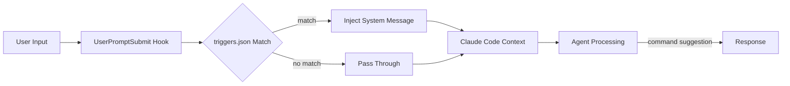

This document explains OMA's **Keyword Trigger system**. It enables users to invoke appropriate Tier-0 workflows via natural language input without memorizing `/oma:*` commands directly.

## Overview

Keyword Trigger works as follows: the `UserPromptSubmit` hook intercepts user input, matches it against a keyword dictionary in `.omao/triggers.json`, and injects matching Tier-0 command hints as system messages. Agents then invoke the command or ask for confirmation.

## Default Mapping Table

Immediately after OMA installation, default triggers are (source: each plugin's [`<plugin>.oma.yaml`](https://github.com/aws-samples/sample-oh-my-aidlcops/tree/main/plugins) DSL `triggers` block, merged into `.omao/triggers.json` by `oma compile`):

| Keyword | Maps to Command | Example Input |
|---|---|---|
| `autopilot` (in AIDLC context) | `/oma:autopilot` | "Run this feature through autopilot end-to-end" |
| `agenticops`, `ops-mode` | `/oma:agenticops` | "Switch prod to ops-mode" |
| `self-improving`, `feedback-loop` | `/oma:self-improving` | "Reflect last week's failures via self-improving" |
| `aidlc` (single feature) | `/oma:aidlc-loop` | "Process this requirement with aidlc loop" |
| `eks-agentic`, `platform-bootstrap` | `/oma:platform-bootstrap` | "Build eks-agentic platform" |
| `inception` | `/oma:inception` | "Run inception phase only" |
| `construction` | `/oma:construction` | "Start construction phase" |

Matching is **case-insensitive substring matching** at word boundaries.

## Mechanics

### Hook Pipeline



### Hook Script Flow

`hooks/user-prompt-submit.sh` performs:

1. Receive user input via stdin
2. Load `.omao/triggers.json` from current project (or fall back to `<repo>/steering/triggers.default.json`)
3. Search input for keywords at word boundaries with lowercase normalization
4. If keywords match, output `{"systemMessage": "Trigger match: /oma:<workflow>"}` to stdout
5. Claude Code injects systemMessage into session context

### Session Initialization

`hooks/session-start.sh` runs when Claude Code session starts and performs:

- Check `.omao/state/active-mode.json` for active Tier-0 mode
- If active, inject context like "Currently running `/oma:autopilot`"
- Expose recent memos from `.omao/notepad.md` to session context

## triggers.json Structure

```json
{
  "version": "1.0",
  "triggers": [
    {
      "keywords": ["autopilot"],
      "command": "/oma:autopilot",
      "context_hints": ["aidlc", "end-to-end", "full-loop"],
      "priority": 10
    },
    {
      "keywords": ["self-improving", "feedback-loop", "feedback loop"],
      "command": "/oma:self-improving",
      "priority": 8
    },
    {
      "keywords": ["platform-bootstrap", "eks-agentic", "eks agentic"],
      "command": "/oma:platform-bootstrap",
      "priority": 9
    }
  ]
}
```

### Field Descriptions

| Field | Type | Description |
|---|---|---|
| `keywords` | `string[]` | Keywords to match. Can include spaces |
| `command` | `string` | `/oma:*` command to suggest on match |
| `context_hints` | `string[]` | Auxiliary keywords that must co-occur to match (optional) |
| `priority` | `int` | Higher values take precedence on simultaneous matches |

### Role of `context_hints`

`autopilot` is a common word outside OMA context. Adding `context_hints: ["aidlc", "end-to-end", "full-loop"]` reduces false positives: the `autopilot` keyword matches only when co-appearing with those hints.

## Adding Custom Triggers

To add project-specific workflows, add entries to `.omao/triggers.json`.

```bash
cd <your-project>
jq '.triggers += [
  {
    "keywords": ["payment-check", "payment check"],
    "command": "/oma:aidlc-loop",
    "context_hints": ["payment", "billing"],
    "priority": 7
  }
]' .omao/triggers.json > /tmp/triggers.new && mv /tmp/triggers.new .omao/triggers.json
```

Project-level triggers take precedence. If the same keyword exists in both project and default, **project triggers match first**.

### Macro Expansion Example

Register frequently-used compound commands under short keywords:

```json
{
  "keywords": ["weekly-improve"],
  "command": "/oma:self-improving",
  "priority": 10
}
```

After this, typing `weekly-improve` triggers the agent to suggest `/oma:self-improving`.

## Disabling Triggers

You can disable triggers system-wide or per-session.

### Environment Variable

```bash
export OMA_DISABLE_TRIGGERS=1
claude
```

With `OMA_DISABLE_TRIGGERS=1` set, `user-prompt-submit.sh` immediately exits with passthrough, skipping trigger matching.

### Permanent Disabling

Delete the OMA hook entry from `~/.claude/settings.json`:

```bash
jq 'del(.hooks.UserPromptSubmit[] | select(.hooks[].command | endswith("/hooks/user-prompt-submit.sh")))' \
  ~/.claude/settings.json > /tmp/settings.new && mv /tmp/settings.new ~/.claude/settings.json
```

To also disable `SessionStart` hook, apply the same pattern separately.

### Single Input Bypass

Prepend `#noauto` to skip trigger matching for that prompt:

```
#noauto General question about autopilot mode
```

The hook detects `#noauto`, passes through, and strips the prefix from final input.

## Matching Rules Details

### Normalization
- Convert input text to lowercase
- Trim leading/trailing and collapse internal whitespace
- Preserve both Korean and English text for hybrid matching

### Word Boundaries
- No substring matching across word breaks (e.g., `auto` does not match within `automobile`)
- Korean lacks word tokenization, so register keywords in exact form (e.g., "자동조종", "자율 모드")

### Multiple Matches
When several triggers match simultaneously, the highest `priority` wins. Within same priority, array order in `triggers.json` is tiebreaker.

### Case Sensitivity
Matching is case-insensitive. The command string in systemMessage is verbatim from `triggers.json`.

## Debugging

### Check Matching Behavior

Manually run the hook script to verify matching:

```bash
echo "Run AIDLC with autopilot" | bash ~/.oma/hooks/user-prompt-submit.sh
# Expected output: {"systemMessage":"Trigger match: /oma:autopilot"}
```

### Inspect Trigger List

```bash
jq '.triggers[] | {keywords, command, priority}' .omao/triggers.json
```

### Collect Logs

Enable debug output in hooks:

```bash
export OMA_TRIGGER_DEBUG=1
claude
# Hook calls log matching results to ~/.claude/logs/oma-triggers.log
```

## Best Practices

### Assign Short Keywords to High-Frequency Workflows
If `/oma:self-improving` is called weekly, register `"weekly-improve"` as a memorable shorthand.

### Use `context_hints` for High-Impact Commands
`/oma:platform-bootstrap` is long-running and costly. Require `context_hints: ["platform", "bootstrap", "eks"]` to prevent accidental invocation.

### Version-Control Team triggers.json
Commit `.omao/triggers.json` to git so the team shares consistent shortcuts. Isolate personal triggers via `.gitignore` of `.omao/triggers.local.json`.

### Accommodate Mixed Languages
For Korean-dominant teams, register both: `["자동조종", "autopilot"]`. Monitor with `OMA_TRIGGER_DEBUG=1` to see which keyword actually matches.

## Security and Audit

- Triggers **suggest** commands but do not auto-execute. Agents ask for confirmation (UX varies by Claude Code version).
- `.omao/triggers.json` is managed as project source, so include it in code review to prevent malicious command injection.
- Setting `OMA_DISABLE_TRIGGERS=1` in CI prevents automation pipelines from accidentally invoking commands.

## Reference Materials

### Official Documentation
- [Claude Code Hooks](https://docs.anthropic.com/claude/docs/claude-code-hooks) — UserPromptSubmit and SessionStart hook standards
- [jq Manual](https://jqlang.github.io/jq/manual/) — Editing triggers.json
- [oh-my-claudecode Keyword Triggers](https://github.com/Yeachan-Heo/oh-my-claudecode) — Reference implementation (OMC)

### OMA Internal Documentation
- [Tier-0 Workflows](./tier-0-workflows.md) — Command details that triggers map to
- [Claude Code Setup](./claude-code-setup.md) — Hook registration procedure
- [Kiro Setup](./kiro-setup.md) — Kiro equivalent mechanism (kiro.meta.yaml trigger_keywords)
- [Introduction](./intro.md) — System overview
