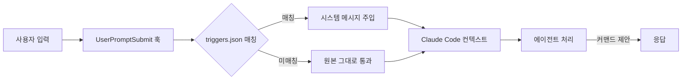

본 문서는 OMA의 **Keyword Trigger 시스템**을 설명합니다. 이 시스템은 사용자가 `/oma:*` 커맨드를 직접 기억하지 않고도 자연어 입력으로 적절한 Tier-0 워크플로우에 진입하도록 돕습니다.

## 개요

Keyword Trigger는 `UserPromptSubmit` 훅이 사용자 입력을 가로채서 `.omao/triggers.json`의 키워드 사전과 매칭한 뒤, 일치하는 Tier-0 커맨드를 시스템 메시지로 주입하는 구조입니다. 에이전트는 이 힌트를 받아 해당 커맨드를 호출하거나 사용자에게 확인을 요청합니다.

## 기본 매핑 테이블

OMA 설치 직후 기본 트리거는 다음과 같습니다(출처: 각 플러그인의 [`<plugin>.oma.yaml`](https://github.com/aws-samples/sample-oh-my-aidlcops/tree/main/plugins) DSL `triggers` 블록, `oma compile` 이 `.omao/triggers.json` 으로 병합).

| 키워드 | 매핑 커맨드 | 예시 입력 |
|---|---|---|
| `autopilot` (AIDLC 문맥) | `/oma:autopilot` | "이 feature를 autopilot으로 끝까지 진행해" |
| `agenticops`, `ops-mode` | `/oma:agenticops` | "prod를 ops-mode로 전환하라" |
| `self-improving`, `feedback-loop` | `/oma:self-improving` | "지난주 실패를 self-improving으로 반영해" |
| `aidlc` (단일 feature) | `/oma:aidlc-loop` | "이 요구사항을 aidlc 루프로 처리해" |
| `eks-agentic`, `platform-bootstrap` | `/oma:platform-bootstrap` | "eks-agentic 플랫폼을 구축해" |
| `inception` | `/oma:inception` | "inception 단계만 돌려줘" |
| `construction` | `/oma:construction` | "construction 단계를 시작해" |

매핑은 **소문자 기준 부분 문자열 매칭**이며, 단어 경계를 존중합니다.

## 동작 원리

### 훅 파이프라인



### 훅 스크립트 흐름

`hooks/user-prompt-submit.sh`는 다음을 수행합니다.

1. 사용자 입력을 stdin으로 수신
2. 현재 프로젝트의 `.omao/triggers.json`을 로드 (없으면 기본값 `<repo>/steering/triggers.default.json` 사용)
3. 입력에서 소문자 정규화된 단어 단위로 키워드 검색
4. 매칭된 키워드가 있으면 `{"systemMessage": "Trigger match: /oma:<workflow>"}`를 stdout에 출력
5. Claude Code가 systemMessage를 세션 컨텍스트에 주입

### 세션 초기화

`hooks/session-start.sh`는 Claude Code 세션이 시작될 때 실행되어 다음을 수행합니다.

- `.omao/state/active-mode.json`에 활성 Tier-0 모드가 있는지 확인
- 활성 모드가 있다면 "현재 `/oma:autopilot` 진행 중입니다" 등의 컨텍스트를 주입
- `.omao/notepad.md`의 최근 메모를 세션 컨텍스트에 노출

## triggers.json 구조

```json
{
  "version": "1.0",
  "triggers": [
    {
      "keywords": ["autopilot"],
      "command": "/oma:autopilot",
      "context_hints": ["aidlc", "end-to-end", "full-loop"],
      "priority": 10
    },
    {
      "keywords": ["self-improving", "feedback-loop", "feedback loop"],
      "command": "/oma:self-improving",
      "priority": 8
    },
    {
      "keywords": ["platform-bootstrap", "eks-agentic", "eks agentic"],
      "command": "/oma:platform-bootstrap",
      "priority": 9
    }
  ]
}
```

### 필드 설명

| 필드 | 타입 | 설명 |
|---|---|---|
| `keywords` | `string[]` | 매칭할 키워드 목록. 공백 포함 가능 |
| `command` | `string` | 매칭 시 제안할 `/oma:*` 커맨드 |
| `context_hints` | `string[]` | 함께 등장해야 매칭되는 보조 키워드 (선택) |
| `priority` | `int` | 동시 매칭 시 높은 값 우선 |

### `context_hints`의 역할

`autopilot`은 Tier-0 커맨드 이외의 문맥에서도 흔히 쓰이는 단어입니다. 이 오탐을 줄이기 위해 `context_hints: ["aidlc", "end-to-end", "full-loop"]`를 추가하면, `autopilot` 키워드는 해당 힌트와 함께 등장할 때만 매칭됩니다.

## 커스텀 트리거 추가

프로젝트 특화 워크플로우를 추가하려면 `.omao/triggers.json`에 항목을 추가합니다.

```bash
cd <your-project>
jq '.triggers += [
  {
    "keywords": ["payment-check", "결제 점검"],
    "command": "/oma:aidlc-loop",
    "context_hints": ["payment", "결제"],
    "priority": 7
  }
]' .omao/triggers.json > /tmp/triggers.new && mv /tmp/triggers.new .omao/triggers.json
```

프로젝트 레벨 트리거는 기본 트리거보다 우선합니다. 같은 키워드가 프로젝트와 기본에 모두 있다면 **프로젝트 트리거가 먼저 매칭**됩니다.

### 매크로 확장 예시

자주 사용하는 복합 명령을 단축 키워드로 등록할 수 있습니다.

```json
{
  "keywords": ["weekly-improve"],
  "command": "/oma:self-improving",
  "priority": 10
}
```

이후 `weekly-improve` 단어만 입력하면 에이전트가 자동으로 `/oma:self-improving`을 제안합니다.

## 트리거 비활성화

상황에 따라 트리거 시스템 전체를 끄거나 특정 세션에서만 비활성화할 수 있습니다.

### 환경 변수

```bash
export OMA_DISABLE_TRIGGERS=1
claude
```

`OMA_DISABLE_TRIGGERS=1`이 설정된 상태에서는 `user-prompt-submit.sh` 훅이 즉시 passthrough로 종료합니다.

### 영구 비활성화

`~/.claude/settings.json`에서 OMA 훅 항목을 삭제하면 됩니다.

```bash
jq 'del(.hooks.UserPromptSubmit[] | select(.hooks[].command | endswith("/hooks/user-prompt-submit.sh")))' \
  ~/.claude/settings.json > /tmp/settings.new && mv /tmp/settings.new ~/.claude/settings.json
```

단, 이 경우 `SessionStart` 훅까지 끄려면 동일 패턴으로 별도 처리해야 합니다.

### 단일 입력 우회

입력 앞에 `#noauto`를 붙이면 해당 프롬프트에 한해 트리거 매칭을 건너뜁니다.

```
#noauto autopilot 모드에 대한 일반 질문이 있어요
```

훅은 `#noauto` 프리픽스를 감지하면 즉시 passthrough하고, 프리픽스는 최종 입력에서 제거됩니다.

## 매칭 규칙 상세

### 정규화
- 입력 텍스트를 소문자로 변환
- 전후 공백 및 중복 공백 제거
- 한국어·영어 혼합 처리 시 원문도 동시에 유지

### 단어 경계
- 공백 없이 긴 문자열 내 매칭은 하지 않음 (예: `automobile`에서 `auto`가 매칭되지 않음)
- 한국어는 조사 어간 분리를 수행하지 않으므로, 정확한 형태로 키워드 등록 필요 (예: "자동조종", "자율 모드")

### 복수 매칭
동시에 여러 트리거가 매칭되면 `priority`가 가장 높은 것을 선택합니다. 동일 priority 내에서는 `triggers.json` 배열 순서가 우선합니다.

### 대소문자
매칭은 대소문자 무시지만, 시스템 메시지에 주입되는 커맨드 문자열은 `triggers.json`에 등록된 그대로 출력됩니다.

## 디버깅

### 매칭 결과 확인

훅 스크립트를 수동 실행해 매칭 동작을 검증합니다.

```bash
echo "autopilot으로 AIDLC를 돌려줘" | bash ~/.oma/hooks/user-prompt-submit.sh
# 기대 출력: {"systemMessage":"Trigger match: /oma:autopilot"}
```

### 트리거 목록 점검

```bash
jq '.triggers[] | {keywords, command, priority}' .omao/triggers.json
```

### 로그 수집

훅 내부 디버그 출력을 활성화하려면:

```bash
export OMA_TRIGGER_DEBUG=1
claude
# 훅 호출 시 ~/.claude/logs/oma-triggers.log 에 매칭 결과 기록
```

## 베스트 프랙티스

### 고빈도 워크플로우에 짧은 키워드 할당
`/oma:self-improving`을 매주 호출한다면 `"weekly-improve"`처럼 기억하기 쉬운 키워드를 별도로 등록합니다.

### 민감한 커맨드는 `context_hints` 사용
`/oma:platform-bootstrap`은 장시간·비용 영향이 큰 작업입니다. `"eks-agentic"` 단독보다 `context_hints: ["platform", "bootstrap", "eks"]`를 요구하도록 구성해 오탐을 방지합니다.

### 팀 표준 triggers.json 버전 관리
프로젝트 `.omao/triggers.json`을 git에 포함시키면 팀 전체가 동일한 단축 명령을 공유합니다. 개인 특화 트리거는 `.gitignore`에 `.omao/triggers.local.json`을 추가해 분리합니다.

### 한국어·영어 혼용 고려
한국어 중심 팀이라면 `["자동조종", "autopilot"]`처럼 양 언어를 함께 등록합니다. `OMA_TRIGGER_DEBUG=1`로 실제 어느 키워드가 매칭되는지 모니터링하는 것이 좋습니다.

## 보안·감사 고려사항

- 트리거는 커맨드를 **제안**할 뿐 자동 실행하지 않습니다. 실행은 에이전트가 사용자에게 확인하는 방식으로 진행됩니다(정확한 UX는 Claude Code 버전에 따라 다름).
- `.omao/triggers.json`은 프로젝트 소스로 관리되므로, 악의적인 커맨드 주입을 방지하려면 코드 리뷰 대상에 포함해야 합니다.
- `OMA_DISABLE_TRIGGERS=1`을 CI 환경에서 기본 활성화하면, 자동화 파이프라인이 의도치 않은 커맨드를 실행하지 않도록 할 수 있습니다.

## 참고 자료

### 공식 문서
- [Claude Code Hooks](https://docs.anthropic.com/claude/docs/claude-code-hooks) — UserPromptSubmit·SessionStart 훅 표준
- [jq Manual](https://jqlang.github.io/jq/manual/) — triggers.json 편집
- [oh-my-claudecode Keyword Triggers](https://github.com/Yeachan-Heo/oh-my-claudecode) — 참조 구현 (OMC)

### OMA 내부 문서
- [Tier-0 Workflows](./tier-0-workflows.md) — 트리거가 매핑하는 커맨드의 상세
- [Claude Code Setup](./claude-code-setup.md) — 훅 등록 절차
- [Kiro Setup](./kiro-setup.md) — Kiro에서의 등가 메커니즘 (kiro.meta.yaml trigger_keywords)
- [Introduction](./intro.md) — 전체 시스템 개요
