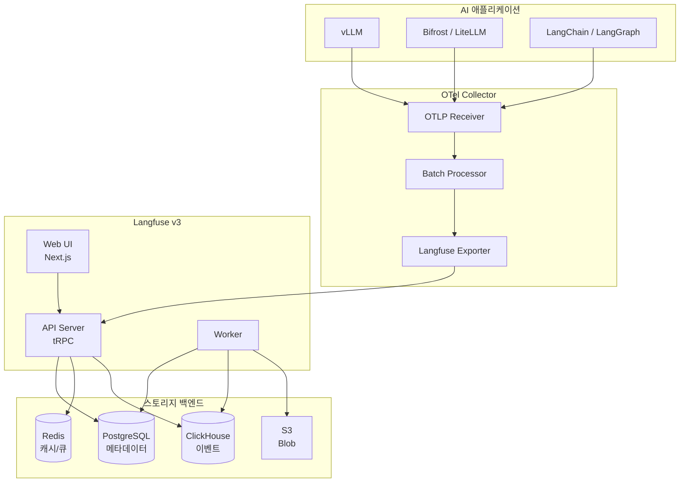

## 개요

본 문서는 Langfuse v3.x 를 AWS EKS 에 자체 호스팅(self-host)할 때 필요한 구성 요소, 설치 절차, OTel 연동, 업그레이드 경로를 정리한 레퍼런스입니다. `langfuse-observability` 스킬과 `langfuse-observer` 에이전트가 본 문서를 공유 참조합니다.

## 배경

LangSmith SaaS 는 빠르지만, 한국 금융·의료·공공 환경에서는 데이터 residency·감사 요구 때문에 self-hosted 관측성 도구가 필요합니다. Langfuse v3 는 ClickHouse 를 1차 이벤트 저장소로 도입하여 수억 건/일 규모 트레이스를 처리할 수 있습니다. Apache 2.0 라이선스로 공개되어 있으며, OpenTelemetry GenAI Semantic Conventions 을 지원합니다.

## 아키텍처



주요 컴포넌트:
- **Web UI**: Next.js, 대시보드·프롬프트·데이터셋·평가 관리
- **API Server**: tRPC 기반, SDK/OTLP 수신
- **Worker**: 이벤트 batch 처리, ClickHouse 적재, S3 업로드
- **PostgreSQL**: 프로젝트·사용자·설정 메타데이터 (RDS 권장)
- **ClickHouse**: 트레이스·스팬 이벤트 저장 (v3 필수)
- **Redis**: 세션·큐·rate limit (ElastiCache Valkey 가능)
- **S3**: 프롬프트 스냅샷, media blob

## 사전 준비

1. EKS 1.32+, IRSA 구성, External Secrets Operator 설치
2. S3 버킷 생성 (`my-langfuse-blobs`), ACL private
3. (선택) RDS PostgreSQL 14+, Aurora 지원
4. (선택) ElastiCache Valkey
5. ClickHouse 는 in-cluster Helm 설치 권장 (Altinity / Bitnami)
6. 사용자 인증 방식 결정: SSO (OIDC), 이메일/비밀번호, GitHub OAuth

## 설치 절차

### Step 1. IRSA 및 Secrets

IRSA 에는 반드시 **Langfuse blob 버킷 한 개로 scope 된 customer-managed policy** 만 attach 합니다. AWS managed `AmazonS3FullAccess` (`s3:*` on `*`) 는 account-wide 접근을 허용하므로 사용하지 않습니다.

```bash
export BUCKET=my-langfuse-blobs
export ACCOUNT_ID=$(aws sts get-caller-identity --query Account --output text)

cat > /tmp/langfuse-s3-policy.json <<EOF
{
  "Version": "2012-10-17",
  "Statement": [
    {
      "Effect": "Allow",
      "Action": ["s3:ListBucket", "s3:GetBucketLocation"],
      "Resource": "arn:aws:s3:::${BUCKET}"
    },
    {
      "Effect": "Allow",
      "Action": [
        "s3:GetObject",
        "s3:PutObject",
        "s3:DeleteObject",
        "s3:AbortMultipartUpload"
      ],
      "Resource": "arn:aws:s3:::${BUCKET}/*"
    }
  ]
}
EOF

aws iam create-policy \
  --policy-name LangfuseBlobStoreRW \
  --policy-document file:///tmp/langfuse-s3-policy.json

eksctl create iamserviceaccount \
  --cluster agentic-prod \
  --namespace langfuse \
  --name langfuse \
  --attach-policy-arn "arn:aws:iam::${ACCOUNT_ID}:policy/LangfuseBlobStoreRW" \
  --approve
```

External Secret 으로 PG/ClickHouse/Redis 비밀번호, OAuth Secret 주입.

### Step 2. Helm 설치
```bash
helm repo add langfuse https://langfuse.github.io/langfuse-k8s
helm upgrade --install langfuse langfuse/langfuse \
  --namespace langfuse --create-namespace \
  --version 1.3.0 \
  -f langfuse-values.yaml
```

### Step 3. values 예시 (프로덕션)
```yaml
langfuse:
  image:
    tag: "3.162.0"
  web:
    replicas: 2
    resources:
      requests: { cpu: "500m", memory: "1Gi" }
      limits:   { cpu: "2",    memory: "4Gi" }
  worker:
    replicas: 2
    resources:
      requests: { cpu: "500m", memory: "2Gi" }
      limits:   { cpu: "4",    memory: "8Gi" }
  nextauth:
    urlSecretName: langfuse-nextauth
  salt:
    secretName: langfuse-salt
postgresql:
  deploy: false
  external:
    host: langfuse-db.cluster-xyz.ap-northeast-2.rds.amazonaws.com
    port: 5432
    database: langfuse
    existingSecret: langfuse-db
clickhouse:
  deploy: true
  shards: 1
  replicas: 2
  persistence:
    size: 500Gi
    storageClass: gp3-xfs
redis:
  deploy: false
  external:
    host: langfuse-redis.xyz.apn2.cache.amazonaws.com
    port: 6379
s3:
  bucket: my-langfuse-blobs
  region: ap-northeast-2
  useIamRole: true
ingress:
  enabled: true
  className: kgateway
  hosts:
    - host: langfuse.internal.example.com
      paths: [{ path: /, pathType: Prefix }]
  tls:
    - secretName: langfuse-tls
      hosts: [langfuse.internal.example.com]
```

### Step 4. OTel Collector 배포
`otel-values.yaml`:
```yaml
mode: deployment
replicaCount: 2
config:
  receivers:
    otlp:
      protocols:
        grpc: { endpoint: 0.0.0.0:4317 }
        http: { endpoint: 0.0.0.0:4318 }
  processors:
    batch:
      send_batch_size: 8192
      timeout: 5s
    attributes:
      actions:
        - key: deployment.environment
          value: prod
          action: upsert
  exporters:
    otlphttp/langfuse:
      endpoint: http://langfuse-web.langfuse.svc:3000/api/public/otel
      headers:
        Authorization: Basic ${env:LANGFUSE_API_BASIC}
  service:
    pipelines:
      traces:
        receivers: [otlp]
        processors: [batch, attributes]
        exporters: [otlphttp/langfuse]
```

```bash
helm upgrade --install otel-collector open-telemetry/opentelemetry-collector \
  --namespace observability --create-namespace \
  -f otel-values.yaml
```

### Step 5. 클라이언트 연결
- vLLM: `OTEL_EXPORTER_OTLP_ENDPOINT=http://otel-collector.observability.svc:4317`
- Bifrost: 위와 동일 + `OTEL_SERVICE_NAME=bifrost`
- LangChain/LangGraph: `langfuse-langchain` SDK + LangfuseCallbackHandler

### Step 6. 초기 설정
- Web UI 접속 → Organization 생성
- Project 생성, API Key 발급 (OTel Basic 토큰 포함)
- Models → 가격표 입력 (token cost 계산)
- Settings → SSO/OIDC 연동

## 운영 팁

### ClickHouse 튜닝
- partition 기준 `toYYYYMM(timestamp)` — 월 단위 파티셔닝
- 30일 이상 데이터는 S3-backed MergeTree 로 이관
- `max_threads=8`, `max_memory_usage=16GB` 등 프로파일 설정

### PostgreSQL
- `pg_partman` 으로 traces 테이블 자동 파티션
- RDS Multi-AZ + Read Replica
- `pgvector` 미사용 (v3 에서는 ClickHouse 사용)

### Redis
- `maxmemory-policy allkeys-lru`
- cluster mode 불필요, replication 으로 충분

### S3 수명 주기
- Intelligent-Tiering 으로 30일 이후 Infrequent Access 자동 전환
- 365일 후 Glacier Deep Archive (규제 감사용)

## 업그레이드 경로

- v2.x → v3.x 마이그레이션: Worker 가 PG 이벤트를 ClickHouse 로 backfill
- PG 용량이 큰 경우 stepwise migration (월 단위)
- 공식 마이그레이션 스크립트: `langfuse migrate-to-v3`
- PG 스냅샷 필수, Blue/Green 배포 권장

## 성능·용량 가이드

| 일 이벤트 수 | 권장 구성 |
|-------------|-----------|
| < 1M | PG only, ClickHouse 비활성 (Dev) |
| 1M - 10M | PG (RDS Small) + ClickHouse 1-shard |
| 10M - 100M | PG (RDS Medium) + ClickHouse 1-shard 2-replica |
| > 100M | PG (Aurora) + ClickHouse 2-shard 2-replica + S3 tiered |

## 보안

- Langfuse Web/API 는 사설 ALB/NLB + Cognito/OIDC 경유만 허용 (0.0.0.0/0 금지)
- API Key 는 External Secrets Operator + Secrets Manager
- IAM 은 Langfuse 버킷 ARN 으로 scope 된 customer-managed policy 만 사용. `AmazonS3FullAccess` 등 `s3:*` account-wide managed policy 금지
- S3 버킷은 bucket-owner-enforced, ACL disabled
- ClickHouse 는 VPC 내부만 접근, TLS 적용
- OTel Collector 는 ServiceAccount `otel-collector` 전용, 최소권한

## 관측성 알림

- Prometheus alerts
  - `langfuse_worker_queue_depth > 10000` 5분 지속
  - `langfuse_api_latency_p95 > 2s`
  - `clickhouse_replica_lag > 30s`
- Slack/PagerDuty 연동
- Langfuse 자체 알림: 프롬프트 에러율, 평가 점수 하락

## 참고 자료

### 공식 문서
- [Langfuse Documentation](https://langfuse.com/docs) — 통합 문서
- [Langfuse Self-Host](https://langfuse.com/docs/deployment/self-host) — 자체 호스팅 가이드
- [Langfuse Helm Chart](https://github.com/langfuse/langfuse-k8s) — 공식 차트
- [OpenTelemetry GenAI Semantic Conventions](https://opentelemetry.io/docs/specs/semconv/gen-ai/)
- [ClickHouse Documentation](https://clickhouse.com/docs)

### 기술 블로그
- [Langfuse v3 Release Notes](https://langfuse.com/changelog) — ClickHouse 도입 배경
- [OTel GenAI 도구 현황](https://opentelemetry.io/blog/2024/otel-generative-ai/)

### 관련 문서 (내부)
- [langfuse-observability Skill](../skills/langfuse-observability/SKILL.md)
- [langfuse-observer Agent](../agents/langfuse-observer.md)
- engineering-playbook: Agent 모니터링 (community resource)
- engineering-playbook: 모니터링 셋업 (community resource)
