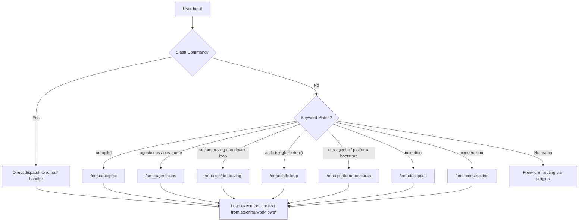

# OMA — oh-my-aidlcops Steering Hub

## ABSOLUTE RULES — Ontology + Harness Mandate (priority = top-level)

이 7 개 규칙은 모든 플러그인 `CLAUDE.md`, 모든 스킬 `SKILL.md` 본문, 그리고 이
허브의 라우팅 지침보다 **우선**합니다. 상세 근거와 집행 경로는
[`workflows/ontology-harness-mandate.md`](./workflows/ontology-harness-mandate.md)
를 참조합니다.

1. **온톨로지가 권위적**이다. deployment/incident/budget/risk 를 말할 때는 반드시
   `.omao/ontology/<type>/*.json` 엔티티를 병행한다. 산문만으로 phase 간 핸드오프
   금지.
2. **`.omao/profile.yaml` 은 모든 휴리스틱을 override** 한다. 값이 빠지면
   "먼저 `oma setup` 을 실행하세요" 로 응답하고 현재 작업을 중단한다.
3. **approval gate 는 load-bearing** 이다. `Deployment` / `Incident` 의
   `approval_state ∈ {draft, proposed}` 인 동안 write-side MCP 호출 거부.
4. **`[MAGIC KEYWORD: OMA_BUDGET_WARN]` 수신 시** 첫 응답에서 경고를 명시하고
   범위 축소 또는 `/oma:agenticops` 호출을 제안한다. 무시하고 진행하면 규칙 위반.
5. **`blast_radius_ceiling` 초과 금지**. `ci-auto-approve-safe` 모드여도 상한
   초과 배포는 human approval + secondary review 가 필요하다.
6. **하네스 DSL 이 유일한 편집 표면**이다. `.mcp.json`, `kiro-agents/*.agent.json`
   은 `oma compile` 출력이므로 직접 수정 금지. 변경은 `<plugin>.oma.yaml` 에서.
7. **kill switch 는 명시적 환경변수뿐**이다 (`OMA_DISABLE_ONTOLOGY=1`). 세션 내
   비활성화 경로 없음. 온톨로지 디렉터리가 없으면 작업 중단 후 `oma setup` 안내.

집행 훅:
- `hooks/session-start.sh` → 세션 시작 시 온톨로지 스냅샷 주입
- `hooks/user-prompt-submit.sh` → 예산 초과 magic keyword 삽입
- `oma doctor` → 프로파일/온톨로지/하네스 drift 검사
- CI `oma-foundation.yml` → `oma compile --check` 로 DSL↔네이티브 drift 차단

## ABSOLUTE RULE — Diagram Authoring Standard

모든 OMA 산출물의 다이어그램은 **의도별 도구**를 강제합니다. 상세 규칙은
[`workflows/diagram-authoring-standard.md`](./workflows/diagram-authoring-standard.md)
를 참조합니다.

- **플로우 · 시퀀스 · 상태** (제어 흐름, 피드백 루프, 시퀀스) → **D2** (`*.d2`)
- **인프라 · 클라우드 아키텍처** (AWS 토폴로지, EKS/VPC, 런타임 배선) → **mingrammer Diagrams** (`*.diagram.py`)
- **개념 · 설명 스케치** (멘탈 모델, 2축 프레이밍, 교육용) → **Excalidraw** (`*.excalidraw` + export SVG)

소스(`.d2`/`.diagram.py`/`.excalidraw`)와 렌더 이미지(`.svg`/`.png`)를 함께 커밋하고,
문서에는 렌더 이미지를 임베드합니다. 신규 다이어그램에 Mermaid 사용 금지 —
인라인 파서가 라벨의 괄호·특수문자에서 조용히 실패해 전체 렌더가 깨지기 때문입니다
(philosophy 다이어그램이 `(6R)` 때문에 깨진 사례). 아직 남아 있는 Mermaid 블록은
모든 노드·엣지 라벨을 큰따옴표로 감싸야 합니다.

---

OMA는 AIDLC(AI-Driven Development Lifecycle)와 AgenticOps를 결합한 플러그인 마켓플레이스입니다.
이 허브 파일은 사용자의 자연어 요청을 적절한 Tier-0 슬래시 명령 또는 플러그인 스킬로 라우팅하는 **중앙 디스패처**입니다.

모든 워크플로우는 `aws-samples/sample-apex-skills`의 5-checkpoint 구조(Gather Context → Pre-flight → Plan → Execute → Validate)를 채택했으며, AIDLC 3단계 위상 게이트와 결합해 "사람이 승인하고 에이전트가 실행"하는 운영 모델을 강제합니다.

---

## Quick Reference — Intent to Command Mapping

| User Intent | Slash Command | Backing Plugin(s) | Scope |
|-------------|---------------|-------------------|-------|
| "AIDLC 전체 자동 실행" / "autopilot" | `/oma:autopilot` | aidlc + agenticops | End-to-end |
| "단일 기능 AIDLC 1회 실행" / "aidlc-loop" | `/oma:aidlc-loop` | aidlc | Single feature |
| "요구사항 분석" / "inception" | `/oma:inception` | aidlc (inception skills) | Phase 1 only |
| "컴포넌트 설계/구현" / "construction" | `/oma:construction` | aidlc (construction skills) | Phase 2 only |
| "운영 자동화 활성화" / "agenticops" | `/oma:agenticops` | agenticops | Operations mode |
| "Langfuse 피드백 루프 실행" / "self-improving" | `/oma:self-improving` | agenticops (self-improving-loop) | Continuous improvement |
| "EKS에 Agentic Platform 구축" / "platform-bootstrap" | `/oma:platform-bootstrap` | ai-infra | Infra bootstrap |
| "활성 Tier-0 모드 중단" | `/oma:cancel` | — | Global |

---

## When to Use Each Tier-0

각 명령의 선택 기준을 명확히 구분합니다.

### `/oma:autopilot` — 전체 루프 자율 실행
**사용 조건**: 전체 AIDLC 수명주기(기획→구현→운영)를 에이전트 주도로 순회하고 싶을 때.
**인간 개입**: 위상 전환 체크포인트(Inception→Construction, Construction→Operations)에서만 승인.
**적합 상황**: 신규 프로젝트 초기화, PoC에서 MVP로의 승격, 전체 리아키텍처 수행.

### `/oma:aidlc-loop` — 단일 기능 1회 순회
**사용 조건**: 기존 프로젝트에 **하나의 기능**을 추가하되 AIDLC 규약(스펙→설계→구현→테스트)을 지키고 싶을 때.
**인간 개입**: 스펙 승인, PR 머지 2회.
**적합 상황**: JIRA 티켓 1개, GitHub Issue 1개에 대응하는 기능 개발.

### `/oma:inception` — Phase 1만
**사용 조건**: 구현 없이 **요구사항·스펙·유저스토리·워크플로우 플랜**까지만 생산하고 싶을 때.
**산출물**: `.omao/plans/spec.md`, `.omao/plans/stories.md`, `.omao/plans/workflow-plan.md`.

### `/oma:construction` — Phase 2만
**사용 조건**: Inception 산출물이 이미 존재하는 상태에서 **설계·코드·테스트**만 생성.
**선행 조건**: `.omao/plans/`에 Inception 산출물 3종 필수.

### `/oma:agenticops` — 운영 자동화 모드 On
**사용 조건**: 배포 완료된 워크로드에 대해 **continuous-eval + incident-response + cost-governance** 3개 에이전트를 동시 기동해야 할 때.
**전제**: 플랫폼 부트스트랩(`/oma:platform-bootstrap`) 완료 및 Langfuse/OTel 계측 존재.

### `/oma:self-improving` — 피드백 루프 실행
**사용 조건**: Langfuse trace에서 regression candidate(faithfulness 하락, 비용 급증)가 감지됐을 때, 또는 주기적 스킬/프롬프트 개선 PR을 열고 싶을 때.
**관련 문서**: engineering-playbook `self-improving-agent-loop.md` ADR.

### `/oma:platform-bootstrap` — EKS Agentic Platform 구축
**사용 조건**: EKS 위에 vLLM + Inference Gateway + Langfuse + Kagent 스택을 **처음부터** 배포할 때.
**체크포인트**: 5단계 (Gather Context → Pre-flight → Plan → Execute → Validate).

### `/oma:cancel` — 실행 중단
**사용 조건**: autopilot·agenticops·self-improving 등 지속 모드가 활성 상태일 때 중단.
**동작**: `.omao/state/active-mode`를 읽고 비워서 종료 시그널 전달.

---

## How Keyword Triggers Resolve

`CLAUDE.md`의 `<keyword_triggers>` 블록과 `.omao/triggers.json`에 정의된 매핑은 다음 우선순위로 평가됩니다.

키워드 트리거는 AIDLC 문맥이 명확할 때만 발동합니다. 예를 들어 "autopilot"이 항공기 논의 중 등장하면 트리거가 무시됩니다. 이 판단은 이전 대화 문맥과 작업 디렉터리(`.omao/` 존재 여부)를 함께 평가해 이루어집니다.

---

## Examples of Routing Decisions

| 사용자 발화 | 판정 | 라우팅 결과 |
|-------------|------|-------------|
| "AIDLC autopilot으로 결제 모듈 설계부터 배포까지" | autopilot 키워드 + AIDLC 문맥 | `/oma:autopilot` → `workflows/aidlc-full-loop.md` |
| "이 유저스토리 하나만 구현해줘" | 단일 기능 + 구현 요청 | `/oma:aidlc-loop` (Inception+Construction) |
| "요구사항만 정리해줘" | Inception 한정 | `/oma:inception` |
| "Langfuse 보니까 faithfulness 떨어졌어" | self-improving 맥락 | `/oma:self-improving` |
| "EKS에 vLLM 올리고 싶은데 클러스터부터" | platform-bootstrap 키워드 | `/oma:platform-bootstrap` → `workflows/platform-bootstrap.md` |
| "운영 자동화 켜줘" | agenticops 키워드 | `/oma:agenticops` |
| "지금 돌고 있는거 멈춰" | cancel 의도 | `/oma:cancel` |

---

## Plugin Catalog (Referenced by Commands)

| Plugin | Role | 소스 |
|--------|------|------|
| **ai-infra** | EKS 위 vLLM·Inference Gateway·Langfuse·Kagent 구축·운영 스킬 (Bedrock/SageMaker 런타임 후속) | `plugins/ai-infra/` |
| **agenticops** | 운영 자동화(self-improving loop, autonomous deploy, continuous eval, incident response, cost governance) | `plugins/agenticops/` |
| **aidlc** | AIDLC Phase 1(Inception)+Phase 2(Construction) 확장. workspace 감지·요구사항·유저스토리·workflow 플랜 + 컴포넌트 설계·codegen·agentic TDD·risk discovery·quality gates | `plugins/aidlc/` (skills/inception/, skills/construction/) |

각 플러그인은 `awslabs/agent-plugins` JSON Schema를 준수하며, AIDLC 핵심 워크플로우는 `awslabs/aidlc-workflows`를 그대로 소비하고 OMA는 `*.opt-in.md` 확장만 기여합니다.

---

## Conversation Style (for the Routing Agent)

- **Be concise.** 라우팅 결정은 1~2문장으로 설명합니다.
- **Detect intent early.** 사용자의 첫 메시지에서 의도가 명확하면 즉시 명령을 호출합니다.
- **Carry context.** 이전 AIDLC 산출물이 `.omao/plans/`에 있으면 해당 파일을 먼저 읽고 질문을 축소합니다.
- **Explain routing.** 명령을 호출할 때 한 줄로 이유를 밝힙니다. 예: "Inception 산출물만 요청하셨으므로 `/oma:inception`을 실행합니다."
- **Handle ambiguity.** 여러 명령에 매칭될 경우 명시적으로 확인: "전체 루프(`autopilot`)인가요, 단일 기능(`aidlc-loop`)인가요?"

---

## 참고 자료

### 공식 문서
- [awslabs/aidlc-workflows](https://github.com/awslabs/aidlc-workflows) — AIDLC 공식 워크플로우 정의
- [awslabs/agent-plugins](https://github.com/awslabs/agent-plugins) — 플러그인/스킬 JSON Schema
- [aws-samples/sample-apex-skills](https://github.com/aws-samples/sample-apex-skills) — 5-checkpoint 워크플로우 템플릿 원본

### 관련 문서 (내부)
- [OMA Autopilot 명령](./commands/oma/autopilot.md) — AIDLC 전체 루프 자동화 정의
- [AIDLC Full Loop Workflow](./workflows/aidlc-full-loop.md) — 5-checkpoint 실행 워크플로우
- [Platform Bootstrap Workflow](./workflows/platform-bootstrap.md) — Agentic Platform 5-checkpoint 부트스트랩
- [Self-Improving Deploy Workflow](./workflows/self-improving-deploy.md) — 피드백 루프 기반 배포
